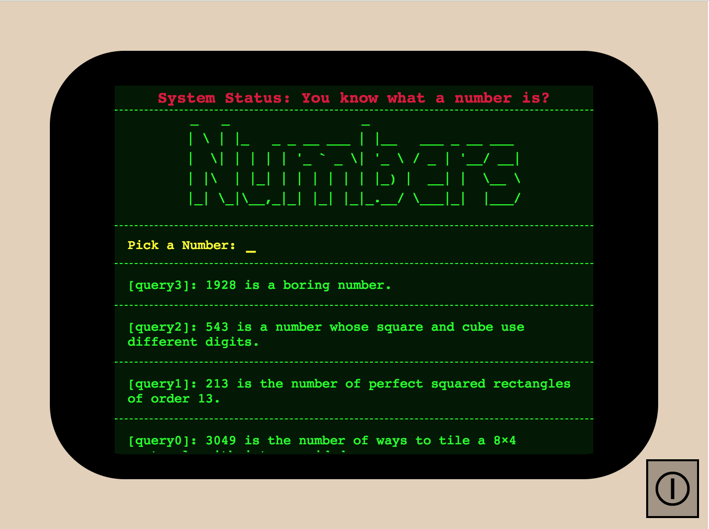

# Number-based JS/API web app, using event-driven design

Week 7 Homework at Codeclan. An App that allows the user to query the Numbers API (http://numbersapi.com/) for information.

Download the project and open index.html to run

Original brief:

### Learning Objectives

- Be able to create a web application with a modular front-end
- Be able to implement reusable and nested views
- Be able to make API requests to load JSON data into your application

## Brief

Your task is to create an application that makes a request to an API and displays the data.

Suggested APIs:

1. REST Countries: https://restcountries.eu/
2. Studio Ghibli: https://ghibliapi.herokuapp.com/
3. Brewdog Beer: https://punkapi.com/

These APIs all allow browser requests without authentification or keys. If you choose to use a different API, make sure you are able to load the data into your application without issues, so that you can spend the time focussing on building your application. We suggest you do not use an API that requires authentification (OAuth), though using an API which requires a key is fine, as long as you are able to get a key quickly and easily.

### MVP

- The application should display data from an API request.
- The application should have a clear separation of concerns using a model and views.

### Extensions

- Take input from the user to update the page. You could update the page by filtering or manipulating the data on user interaction, or you might make further API requests to load more data that is then displayed.

### Advanced Extensions

Looking into a library to visual the data.

- [Leaflet](https://leafletjs.com/) is an open-source library for rendering maps
- [HighCharts](https://www.highcharts.com/) is an open-source library for rendering charts

You will need to use the library's documentation to integrate it into your application.

## Considerations

To make the request you may use either `fetch` or the `XMLHttpRequest` object.

## Planning

- Look at the JSON you are going to be loading into your app and based on the data, draw a wireframe
- Start by loading the data from the API into your application and checking that it has loaded, before doing any work on the views
- Plan your models and your views and draw a diagram of the data flow through the application
